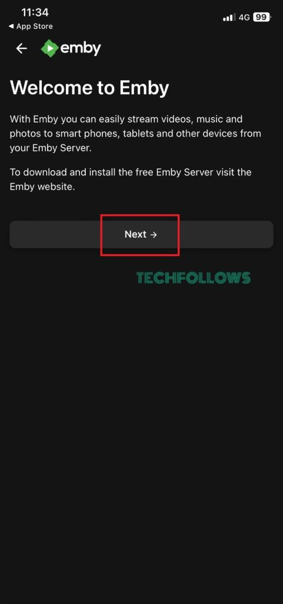
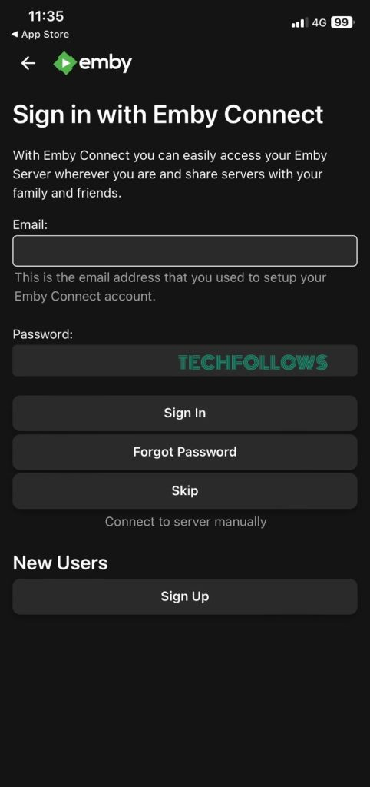
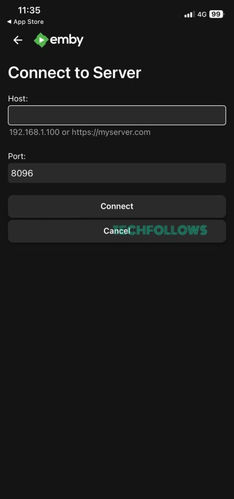

This will walk you through setting up your emby client to login to BSN! (This is intended for BSN Network users only)

1. Open the Emby app
2. On the welcome screen, tap the Next button. If it asks permission to access Bluetooth and WiFi, tap the Allow button.
3. Click on the Skip button to configure manual connection.
4. Enter your Emby Server Host URL and Port ID.

| Field | Entry |
| ----- | ----- |
| Server URL | https://media.basestation.space |
| Port | 443 |

Visual Guide [^1]

| Step 1. | Step 2. | Step 3. |
| ------- | ------- | ------- |
|  |  |  |

Footnotes:
[^1]: Visual guide photos are from [techfollows.com](https://www.techfollows.com/emby/emby-for-ios/)