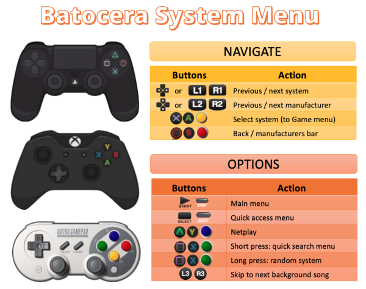
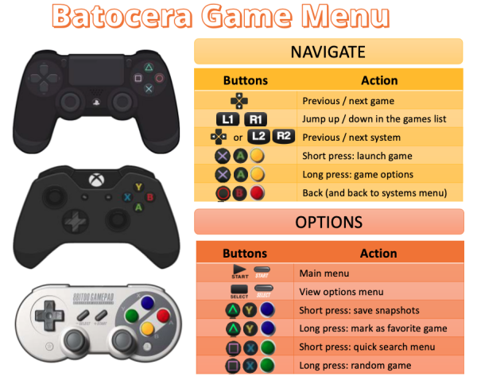

EmulationStation has several common functions mapped to certain buttons. As everyone uses different controllers and often times remap them, we usually refer to the four action buttons as North/East/South/West. These are represented graphically below.
|  UP   | RIGHT | DOWN  |  LEFT | 
| ----- | ----- | ----- | ----- |
|  |  |  |  |

You can see some common ES functions and how they map to the PlayStation, Xbox and SNES controllers in the tables below.

| Batocera System Menu | Batocera Game Menu |
| -------------------- | ------------------ |
|  |  |